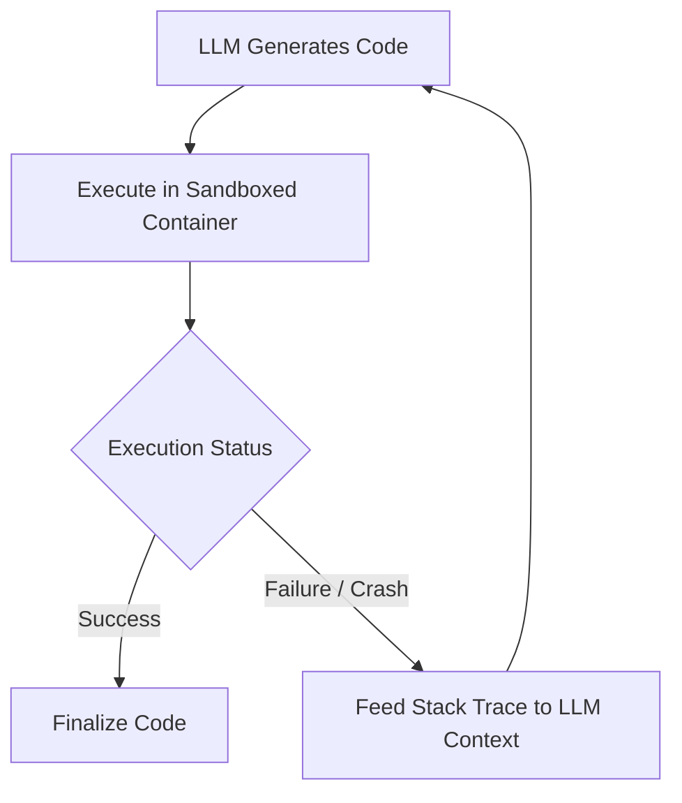

# Extrinsic Programmatic Self-Correction (Compiler-in-the-Loop)

## Overview
Hardcoded environments like Python sandboxes or theorem provers executing model code and returning compilation traces directly back to the context window.

## Architecture & Workflow

## Detailed Explanation
Self-correction enables AI agents and reasoning models to dynamically recover from computational or logical dead ends. In the context of **Extrinsic Programmatic Self-Correction (Compiler-in-the-Loop)**, this is achieved by continuously matching output metrics against defined constraints and executing correction paths.

### Core Mechanics
1. **Error Detection:** Verifying output structure using internal checkers or external validation pipelines.
2. **Backtracking:** Adjusting processing targets or memory pointers to pivot away from identified issues.
3. **Refinement:** Incorporating feedback directly into subsequent generation passes to establish a correct output path.

[← Back to README](../README.md)
