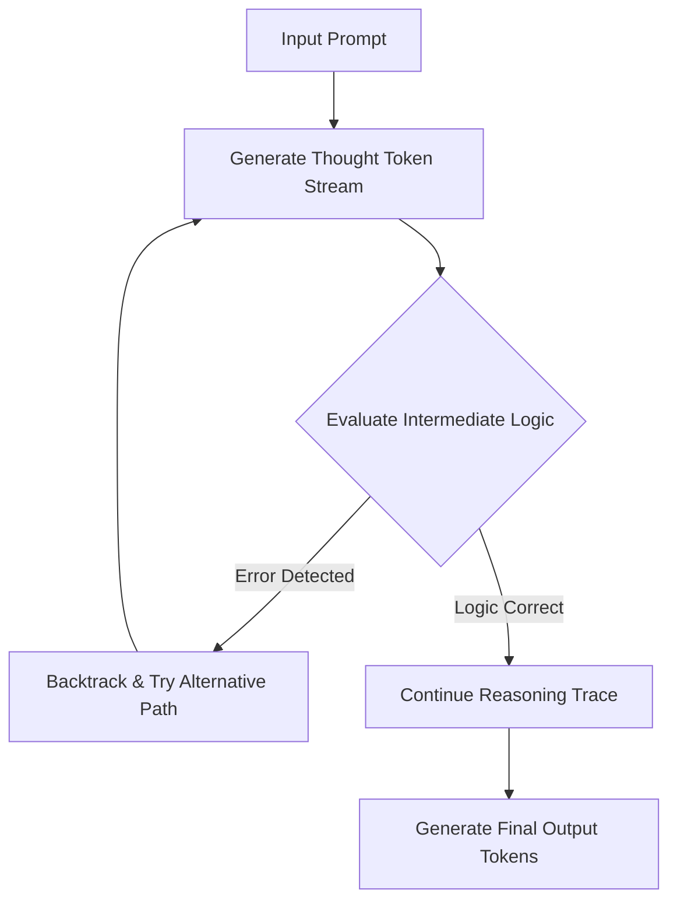

# Native Reinforcement-Learned Thinking (o1/R1)

## Overview
Models trained via large-scale RL to natively produce internal thinking traces, allowing them to search, backtrack, and correct reasoning errors at test-time.

## Architecture & Workflow

## Detailed Explanation
Self-correction enables AI agents and reasoning models to dynamically recover from computational or logical dead ends. In the context of **Native Reinforcement-Learned Thinking (o1/R1)**, this is achieved by continuously matching output metrics against defined constraints and executing correction paths.

### Core Mechanics
1. **Error Detection:** Verifying output structure using internal checkers or external validation pipelines.
2. **Backtracking:** Adjusting processing targets or memory pointers to pivot away from identified issues.
3. **Refinement:** Incorporating feedback directly into subsequent generation passes to establish a correct output path.

[← Back to README](../README.md)
