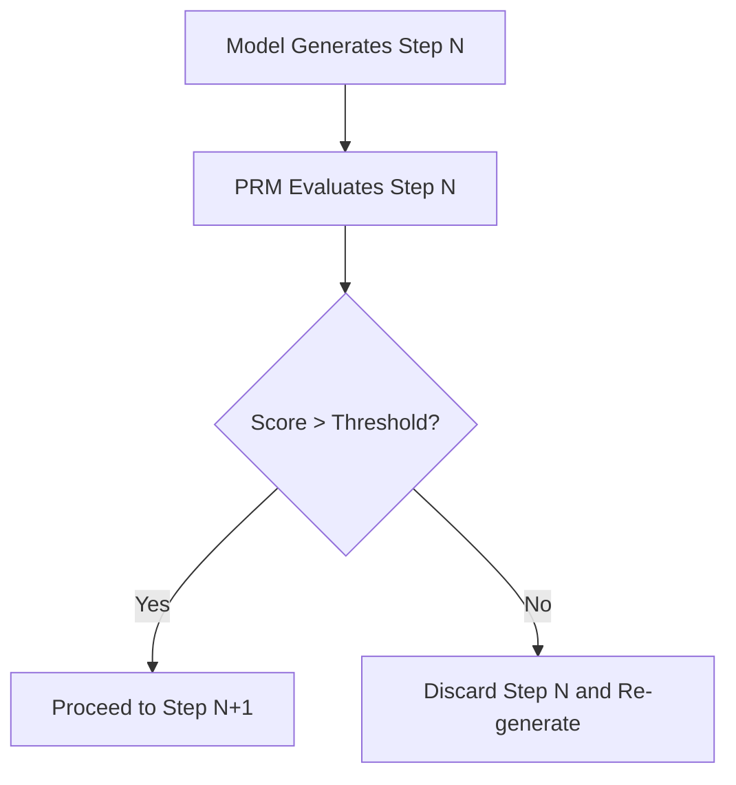

# Reward-Model Guided Correction (PRM Steering)

## Overview
Secondary process-supervised reward models auditing each reasoning token block and halting generation if the confidence score drops.

## Architecture & Workflow

## Detailed Explanation
Self-correction enables AI agents and reasoning models to dynamically recover from computational or logical dead ends. In the context of **Reward-Model Guided Correction (PRM Steering)**, this is achieved by continuously matching output metrics against defined constraints and executing correction paths.

### Core Mechanics
1. **Error Detection:** Verifying output structure using internal checkers or external validation pipelines.
2. **Backtracking:** Adjusting processing targets or memory pointers to pivot away from identified issues.
3. **Refinement:** Incorporating feedback directly into subsequent generation passes to establish a correct output path.

[← Back to README](../README.md)
